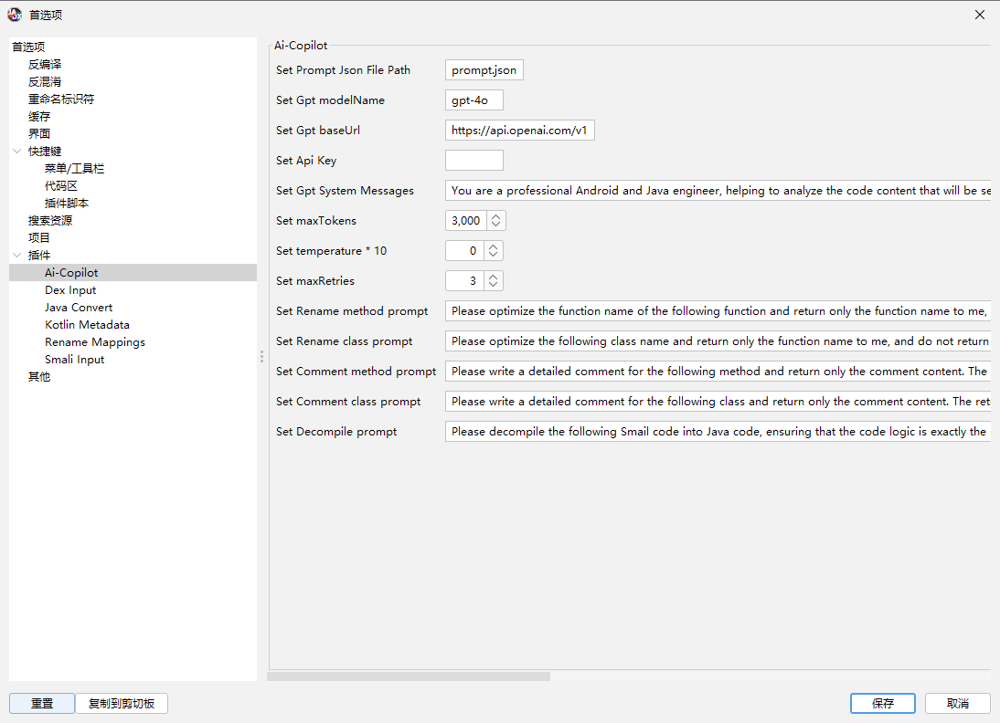

# jadx-ai-copilot-plugin

[English](https://github.com/Wker666/jadx-ai-copilot-plugin/blob/main/README_EN.md)

这是一个让jadx支持AI的插件。
目前支持的AI模型由 [LangChain4j](https://github.com/langchain4j/langchain4j/)提供，使用前配置好base url、model以及ApiKey即可。

## 插件目前支持的功能
1. Ai 分析
2. Ai 重命名
3. Ai 注释
4. Ai 反编译

## 环境

* jdk17+
* jadx 1.5.1+

## 使用

### 安装
jadx安装插件：
```bash
jadx plugins --install "github:Wker666:jadx-ai-copilot-plugin"
```
或者在UI界面点击 插件->安装插件，选择对应插件即可。

### 配置
在Jadx的首选项中选择 Ai-Copilot 插件进行配置。



* prompt: 此处填写Ai 分析时使用的提示词保存的位置，默认不存在的插件会自动写入一份默认配置到当前位置，具体的提示词下面会着重解释
* baseUrl: 模型提供的Api地址及，例如ChatGPT: https://api.openai.com/v1
* model: 模型名称，例如: gpt-4o
* Api Key: key
* System messages: 对话的系统消息
* maxTokens: 最大返回的token个数
* temperature: temperature
* maxRetires: 最大的尝试次数
* Rename: 此处建议不要改动了，因为重命名时需要精准的返回一个内容，此提示词暂时在各模型表现可以
  * method: 重命名方法时的提示词
  * class: 重命名类时的提示词
* Comment:
  * method: 编写方法注释时的提示词
  * class: 编写类注释时的提示词
* Decompile: AI 反汇编时的提示词，Ai 反汇编会获取方法的smail代码发送给AI进行反编译，可以将无法反编译的代码一定程度的还原，但是不可完全相信。

* Proxy:
  * 使用socks5代理访问

配置完毕之后，可以在打开某个反编译项目时看到插件下方的 Jadx Ai Copilot 选项，点击之后检查当前的配置：


点击test会发送一句Hello到AI服务商接受相对应的数据。

如果返回下面类似的内容则代码配置成功。


## 使用

### Ai Rename

选择一个类或者方法单击右键选择 Ai Rename, 即可对方法或者类进行重命名


### Ai Comment

同上

### Ai Decompile

同上，仅对方法有效。

### Ai Rename All Class method

同上，仅对类有效。

### Ai Analyze

此功能对字段、方法、类均有效。

右键点击想要分析的成员，将会打开新的窗口（可能需要等待一段时间，根据项目大小，此窗口处于置顶状态）：


#### 单击

单击左侧图中的节点，可以在jadx界面中跳转到对应节点

#### 双击

双击左侧途中的节点，将会根据交叉引用以及调用等内容，绘制在图中，例如：


#### 右键

如果没有选择置顶的节点，则会弹出添加菜单，填写需要添加 类 方法 字段等，确定之后将会在左侧图中添加进来。


当然新添加的节点也是支持其他功能。

> 类 成员 方法有不同的表示形式，分别为 矩形 云朵 椭圆
> 主要节点也就是默认选择的节点将会用黄色表示

如果当前存在选中的节点、边、多个节点边，则会弹出对应到prompt中配置的提示词信息


> 此处我需要先简单介绍一下 节点和边的概念。
> * 节点：类、方法、成员分别代表一个节点，AI分析中将会发送反编译的代码
> * 边： 连接两个节点，将会连接节点的内容

其中提示词的内容来自于先前配置的prompt.json中，例如：
```json
{
	"security_analysis": {
		"vulnerability_analysis": {
			"Node": "Identify and explain potential security vulnerabilities in the following Java code in detail:",
			"Edge": "Identify and explain the security vulnerabilities in the following two Java codes and their connection in detail:",
			"Clutter": "Identify and explain the security vulnerabilities in the following Java code segments and their connections in detail:"
		}
	}
}
```
其中类别为 security_analysis -> vulnerability_analysis
其中对应的Node为选择一个节点时携带的提示词，Edge为选择一条边时携带的提示词，Clutter为选择多个边和节点时携带的提示词。

当然默认下会有一个custom prompt可以使用自定义的提示词。

点击指定的提示词之后，会发送相关的信息AI服务器，返回的内容将在左侧进行显示：


每次提问的内容和结果将会保存到历史记录中，在之后的询问中将会作为上下文进行提供。

