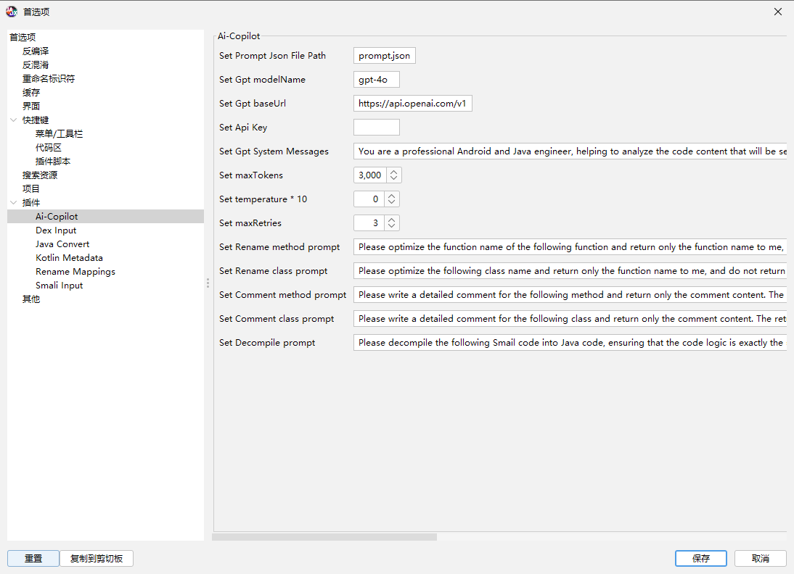
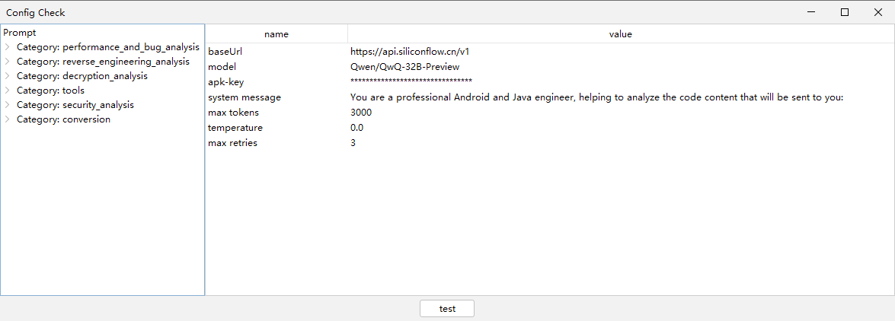
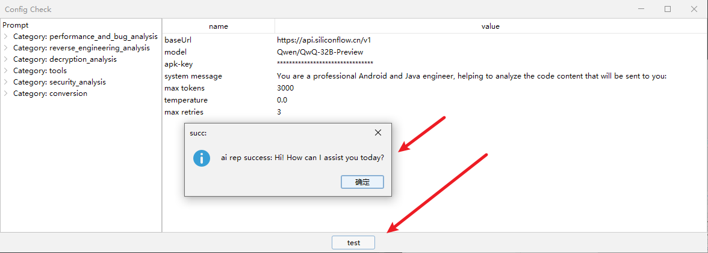
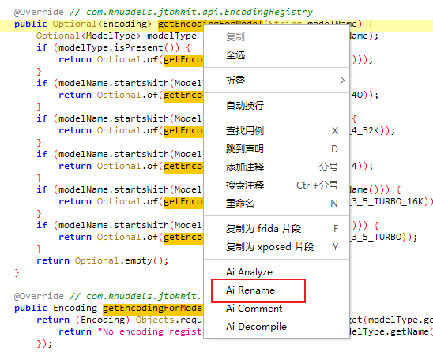
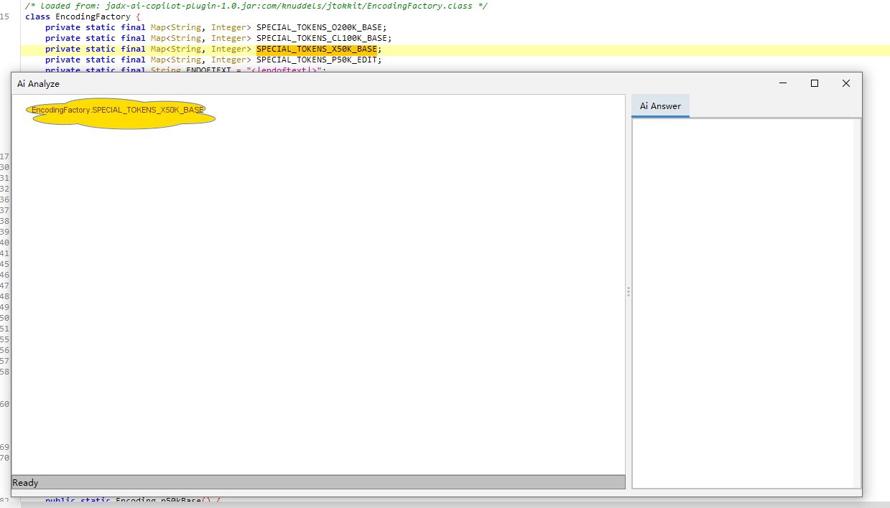
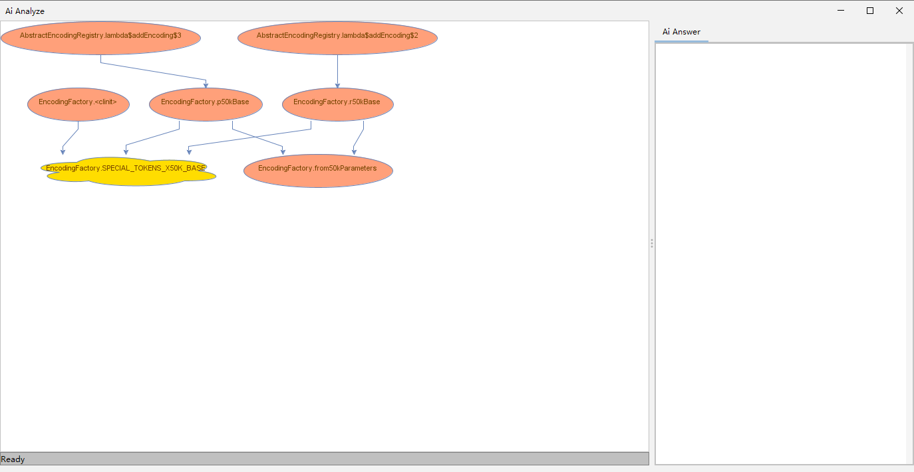
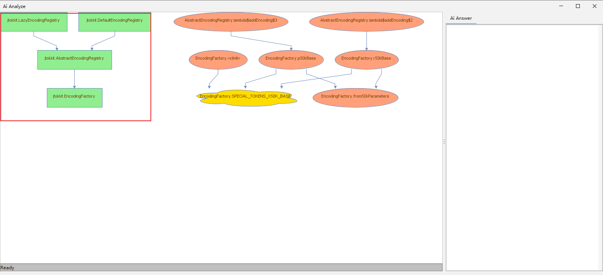
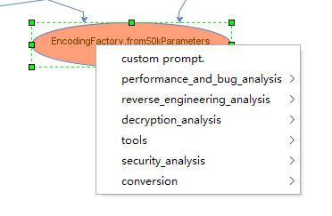
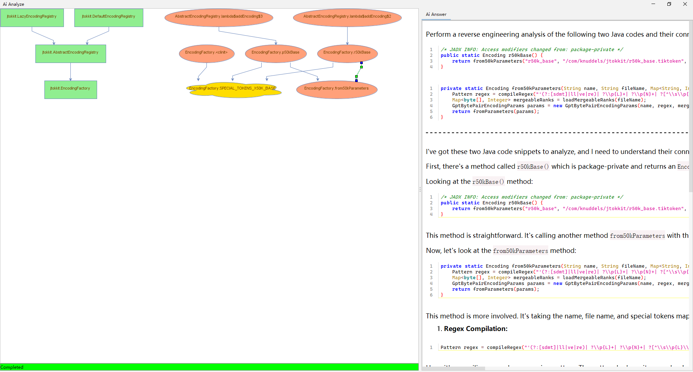

# jadx-ai-copilot-plugin

This is a plugin that enables jadx to support AI.
Currently, the supported AI models are provided by [LangChain4j](https://github.com/langchain4j/langchain4j/). You just need to configure the base url, model, and ApiKey before use.

## Features
1. AI Analysis
2. AI Renaming
3. AI Commenting
4. AI Decompile

## Environment

* JDK 17+
* Jadx 1.5.1+

## Usage

### Installation
To install the plugin in Jadx:
```bash
jadx plugins --install "github:Wker666:jadx-ai-copilot-plugin"
```
Alternatively, you can click `Plugins` -> `Install Plugin` in the UI and select the corresponding plugin.

### Configuration
Select the Ai-Copilot plugin in Jadx's preferences for configuration.



* prompt: Enter the location where the prompt used for AI analysis is saved. If it doesn't exist by default, the plugin will automatically write a default configuration to the current location. The specific prompt will be explained in detail below.
* baseUrl: The API address provided by the model. For example, for ChatGPT: https://api.openai.com/v1.
* model: The name of the model. For example: gpt-4o.
* Api Key: The key.
* System messages: The system messages for the conversation.
* maxTokens: The maximum number of tokens to be returned.
* temperature: The temperature.
* maxRetries: The maximum number of attempts.
* Rename: It is recommended not to modify this part because a precise return is required during renaming. This prompt currently performs well across models.
	* method: The prompt for renaming methods.
	* class: The prompt for renaming classes.
* Comment:
	* method: The prompt for writing method comments.
	* class: The prompt for writing class comments.
* Decompile: The prompt for AI decompilation. AI decompilation will send the smali code of the method to the AI for decompilation, which can restore the code that cannot be decompiled to a certain extent, but you can't fully trust it.

* Proxy:
	* use socks5 request


After the configuration is completed, you can see the `Jadx Ai Copilot` option below the plugin when opening a decompilation project. Click it to check the current configuration:



Click `test` to send a "Hello" message to the AI service provider and receive the corresponding data.

If the following similar content is returned, the code configuration is successful.


## Usage

### AI Rename

Select a class or method, right-click, and choose `AI Rename` to rename the method or class.


### AI Comment

Same as above.

### AI Decompile

Same as above, but it only works for methods.

### Ai Rename All Class method

Same as above, but it only works for class.

### AI Analyze

This function works for fields, methods, and classes.

Right-click on the member you want to analyze, and a new window will open (it may take some time depending on the project size, and this window will be on top):


#### Single Click

Click on a node in the left graph to jump to the corresponding node in the Jadx interface.

#### Double Click

Double-click on a node in the left graph, and based on cross-references and calls, relevant content will be drawn in the graph. For example:


#### Right Click

If no node is selected to be on top, an add menu will pop up. Fill in the class, method, field, etc. you want to add. After confirmation, they will be added to the left graph.



Of course, the newly added nodes also support other functions.

> Classes, members, and methods have different representations, which are rectangles, clouds, and ellipses respectively.
> The main node, which is the default selected node, will be marked in yellow.

If there are currently selected nodes, edges, or multiple nodes and edges, the prompt information configured in the prompt will pop up.



> Here, I need to briefly introduce the concepts of nodes and edges.
> * Node: A class, method, or member represents a node. The decompiled code will be sent during AI analysis.
> * Edge: It connects two nodes and represents the connection between the nodes' content.

The content of the prompt comes from the previously configured `prompt.json`. For example:
```json
{
    "security_analysis": {
        "vulnerability_analysis": {
            "Node": "Identify and explain potential security vulnerabilities in the following Java code in detail:",
            "Edge": "Identify and explain the security vulnerabilities in the following two Java codes and their connection in detail:",
            "Clutter": "Identify and explain the security vulnerabilities in the following Java code segments and their connections in detail:"
        }
    }
}
```
The category is `security_analysis` -> `vulnerability_analysis`.
The corresponding `Node` is the prompt carried when selecting a single node, `Edge` is the prompt carried when selecting an edge, and `Clutter` is the prompt carried when selecting multiple edges and nodes.

Of course, there is a `custom prompt` by default that allows you to use a custom prompt.

After clicking the specified prompt, relevant information will be sent to the AI server, and the returned content will be displayed on the left:



The content and results of each question will be saved in the history, which will be provided as context for subsequent inquiries.
